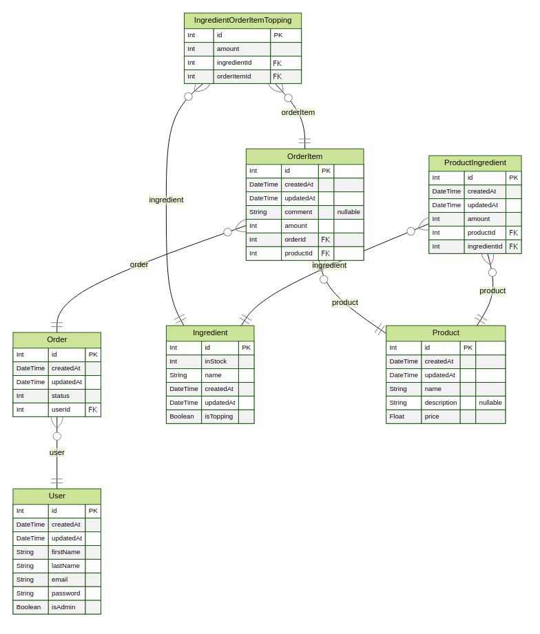

# FastPizza

Velkommen til pizza program. Speedrunnet på et par timer til et skoleprojekt.

## Kørsel

### Docker

Det er anbefalet at køre det gennem docker da det er testet på den måde

```bash
docker build -t pizza-program .
docker run -it pizza-program
```

### Python

Dette projekt er skrevet i Python 3.10.

Du kan køre det med følgende kommando:

```bash
python main.py
```

## Todo

- [ ] Admin panel

## Entity Relationship Diagram


